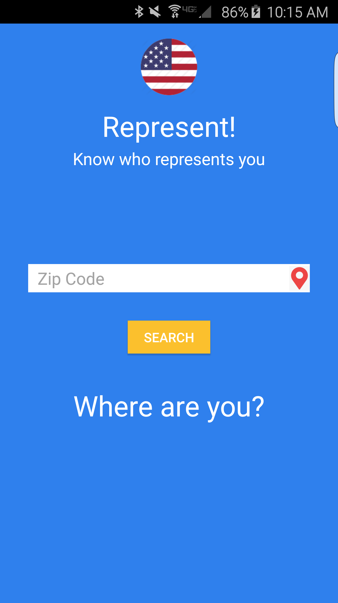
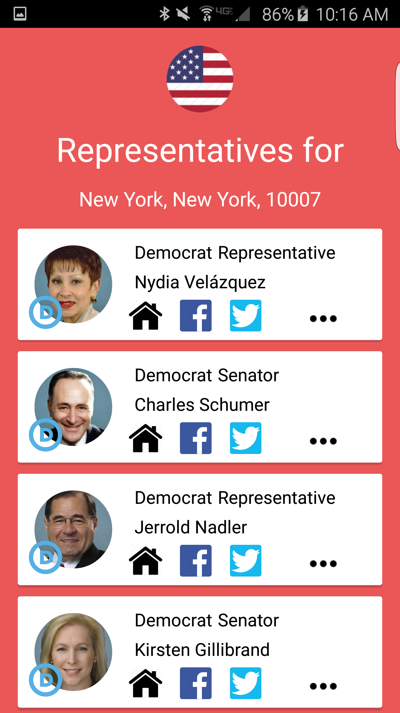
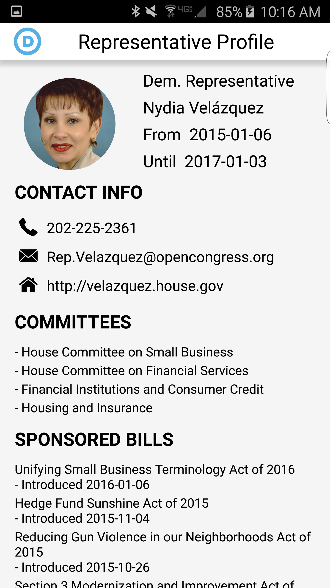
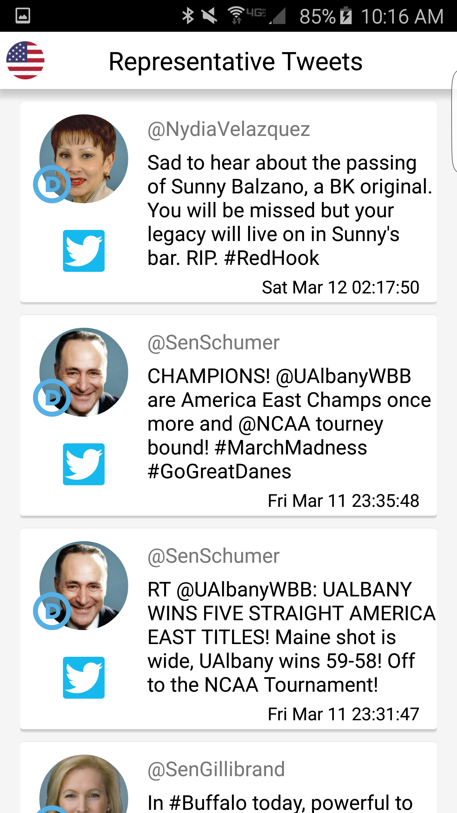
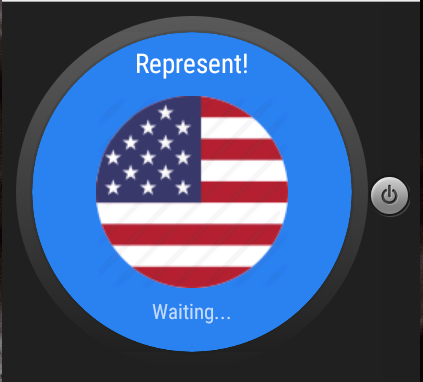
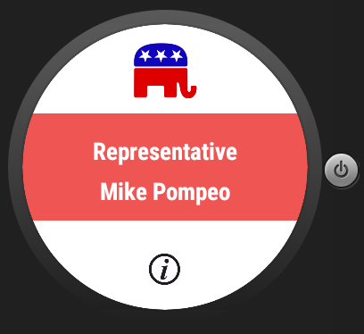
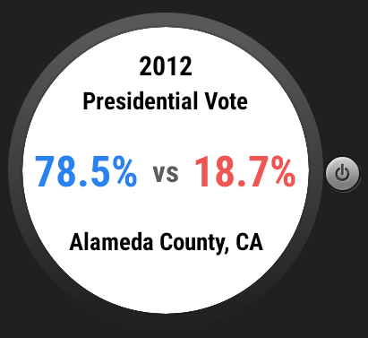

# PROG 02: Represent!

We are all affected by politics, but so few of us have the time to really keep up to date with it.
Voter participation is at an all time low, and misinformation and ignorance are one of the most dangerous
political forces in our era. 

Maybe this app can help address that. The goal of this application is to help everyday users have quick access to who represents them politically. 
Not only getting a basic sense of who the political representatives are in a given area, but also detailed information about them as well. What 
do they stand for, and what are they saying? These are all things that we should know about the people who are supposed to represent us.

## Screenshots

## Authors

Shin Yoon ([shinmyung0@berkeley.edu](mailto:shinmyung0@berkeley.edu))

## Demo Video

See [Represent demo] (https://www.youtube.com/watch?v=U4z9XlNGyGw)

